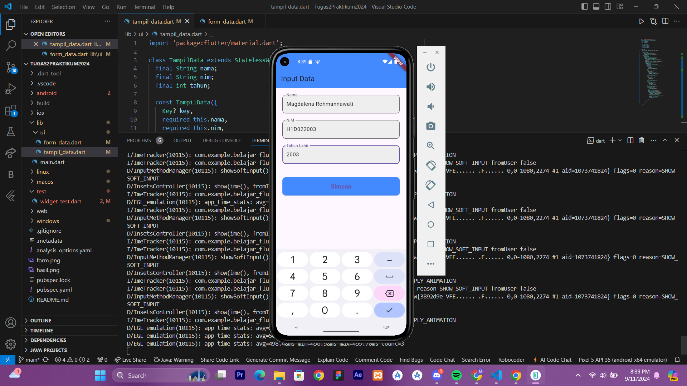
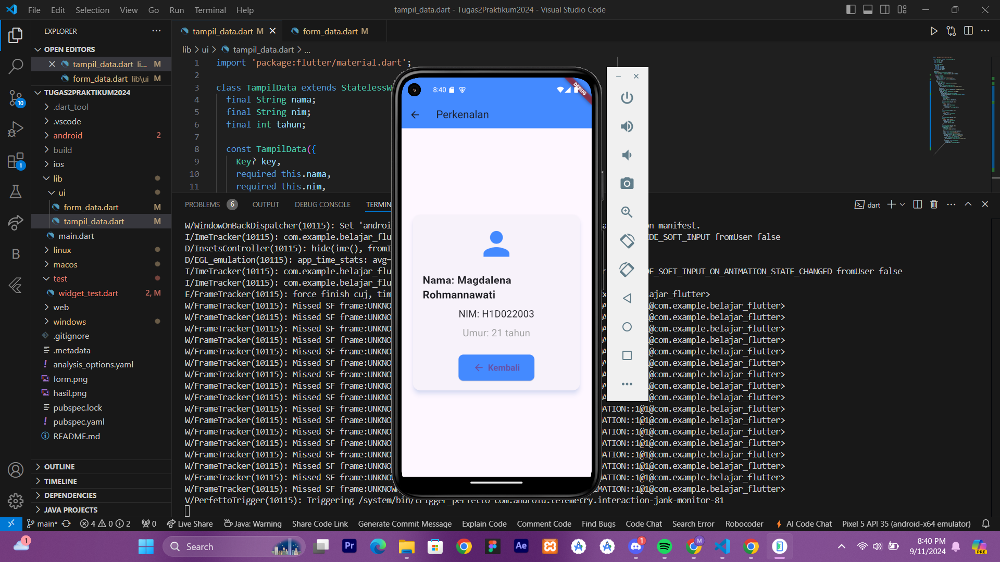

# Tugas Pertemuan 2

Nama : Magdalena Rohmannawati

NIM : H1D022003

Shift Baru: A

1. Pengisian Form di Form_Data.dart
   *Pada halaman Form_Data.dart, pengguna mengisi tiga input yaitu Nama, NIM, dan Tahun Lahir melalui TextField.
   *Ketika pengguna menekan tombol Simpan, event onPressed dari tombol ElevatedButton dipicu.
   *Dalam event onPressed, berikut yang terjadi:
    Data yang diinputkan pengguna pada TextField diambil menggunakan TextEditingController:
      -String nama = _namaController.text → Mengambil nilai dari input Nama.
      -String nim = _nimController.text → Mengambil nilai dari input NIM.
      -int tahun = int.parse(_tahunController.text) → Mengambil nilai dari input Tahun Lahir (dikonversi menjadi tipe data int).
2. Navigasi dengan Navigator.push
   *Setelah data diambil, Navigator.push digunakan untuk berpindah ke halaman baru, yaitu halaman TampilData.
   *Pada saat pemanggilan Navigator.push, data yang diambil dari form (Nama, NIM, dan Tahun Lahir) disertakan dalam pemanggilan konstruktor TampilData sebagai parameter:
    Navigator.of(context).push(MaterialPageRoute(
      builder: (context) =>
        TampilData(nama: nama, nim: nim, tahun: tahun)));
      TampilData adalah halaman baru yang akan ditampilkan, dan data nama, nim, dan tahun dipassing melalui konstruktor ke dalam kelas TampilData.
3. Menerima Data di Halaman Tampil_Data.dart
  *Kelas TampilData menerima data tersebut melalui parameter konstruktor
  *Data yang dipassing dari halaman form diterima dan disimpan dalam variabel nama, nim, dan tahun yang bertipe final.
4. Penggunaan Data di Tampil_Data.dart
  *Data yang sudah diterima digunakan di dalam metode build() pada halaman Tampil_Data.dart. Contohnya, variabel nama, nim, dan tahun digunakan untuk menampilkan informasi pada tampilan.
  *Di sini, informasi seperti Nama, NIM, dan Umur (yang dihitung dari DateTime.now().year - tahun) ditampilkan pada halaman.

## Screenshot
Contoh :

